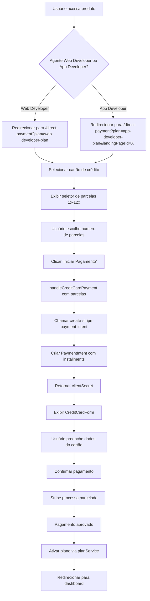

# PLANO DE AÇÃO: IMPLEMENTAÇÃO DE PARCELAMENTO NO CARTÃO DE CRÉDITO (ATÉ 12X SEM JUROS)

## ⚠️ IMPORTANTE: NÃO MODIFICAR ASAAS
**ESTRITAMENTE PROIBIDO** modificar qualquer requisição do Asaas (PIX). O parcelamento é APENAS para Stripe (cartão de crédito). Todas as funções e fluxos do PIX permanecem INALTERADOS.

## Escopo
Implementar parcelamento para:
- **Plano App Developer**: Preço do Supabase
- **Produto Agente Web Developer**: Preço do plano "website" no Supabase

## Análise Atual

### Front-end (DirectPaymentPage.tsx)
- Pagamento único usando Stripe PaymentIntent
- CreditCardForm coleta dados do cartão
- Sem opção de parcelamento
- Suporte limitado para planos não listados (app-developer-plan)

### Back-end (Edge Functions)
- **NÃO MODIFICAR**: Nenhuma função Asaas (create-asaas-payment, verify-payment-status, etc.)
- `create-stripe-payment-intent`: Cria PaymentIntent para pagamento único (MODIFICAR apenas esta)
- Ativação do plano após confirmação
- planService para planos especiais (website/app-developer)

### Stripe
- Suporte a parcelamento no Brasil via `installments` no PaymentIntent
- Permite até 12 parcelas sem juros (depende da configuração da conta)

## Fluxo Proposto



## Etapas de Implementação

### 1. Análise Técnica
- [ ] Verificar documentação Stripe para installments no Brasil
- [ ] Confirmar se conta Stripe suporta parcelamento
- [ ] Analisar função `create-stripe-payment-intent` atual
- [ ] Garantir que planos estejam ativos (is_active = true) no Supabase com preços definidos
- [ ] Garantir que planos estejam ativos (is_active = true) no Supabase

### 2. Front-end Changes
- [ ] **CRÍTICO**: Remover TODOS os preços hardcoded - usar exclusivamente selectedPlanData.price do Supabase
- [ ] Corrigir lógica para garantir que selectedPlanData seja encontrado para app-developer-plan e website
- [ ] Adicionar estado `installments` (padrão: 1)
- [ ] Criar componente seletor de parcelas (dropdown 1x a 12x)
- [ ] Exibir valor por parcela dinamicamente (total / installments)
- [ ] Modificar `handleCreditCardPayment` para enviar `installments`
- [ ] Atualizar UI para mostrar parcelas apenas para cartão

### 3. Back-end Changes
- [ ] **NÃO TOCAR**: Nenhuma função Asaas (create-asaas-payment, verify-payment-status, etc.)
- [ ] Modificar APENAS `create-stripe-payment-intent` para aceitar `installments`
- [ ] Calcular valor por parcela (total / installments)
- [ ] Configurar PaymentIntent com `payment_method_options.card.installments`
- [ ] Garantir que installments seja passado corretamente
- [ ] Verificar se planService funciona com pagamentos parcelados (não modificar)

### 4. Implementação Específica para Agente Web Developer
- [ ] Criar botão de contratação no Dashboard para Agente Web Developer
- [ ] Redirecionar para `/direct-payment?plan=web-developer-plan`
- [ ] Configurar preço e ativação similar ao app-developer-plan
- [ ] Garantir que parcelamento funcione para assinaturas mensais/anuais

### 5. Testing
- [ ] Testar parcelamento no Plano App Developer
- [ ] Testar parcelamento no Agente Web Developer
- [ ] Verificar cálculo correto dos valores para ambos
- [ ] Confirmar processamento no Stripe Dashboard
- [ ] Testar ativação do plano após parcelamento

## Considerações Técnicas

### Cálculo de Parcelas
```javascript
const totalAmount = selectedPlanData.price * 100; // Preço em centavos
const installments = selectedInstallments;
const amountPerInstallment = Math.ceil(totalAmount / installments);
```

### Stripe PaymentIntent
```javascript
{
  amount: totalAmount,
  currency: 'brl',
  payment_method_options: {
    card: {
      installments: {
        enabled: true,
        plan: {
          count: installments,
          interval: 'month'
        }
      }
    }
  }
}
```

### UI/UX
- Mostrar seletor apenas quando cartão selecionado
- Exibir "R$ XXX,XX em Yx de R$ ZZZ,ZZ"
- Manter design consistente com o app

## Riscos e Mitigações
- **Modificar Asaas por engano**: Estar atento - NÃO TOCAR em nenhuma função Asaas
- **Stripe não suportar installments**: Verificar documentação e conta Stripe
- **Cálculo incorreto de parcelas**: Implementar testes unitários
- **Ativação do plano falhar**: Garantir que paymentIntentId seja passado corretamente
- **Preços hardcoded**: Usar exclusivamente selectedPlanData.price do Supabase

## Timeline Estimado
- Análise: 1 dia
- Implementação front-end: 2 dias
- Implementação back-end: 2 dias
- Testing: 2 dias
- **Total: 1 semana**</content>
